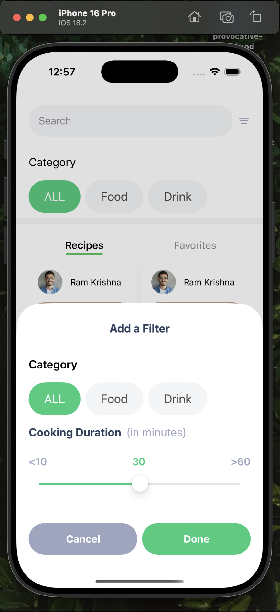
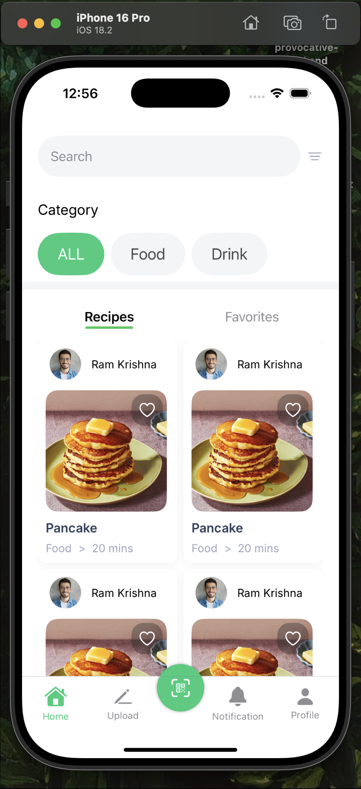
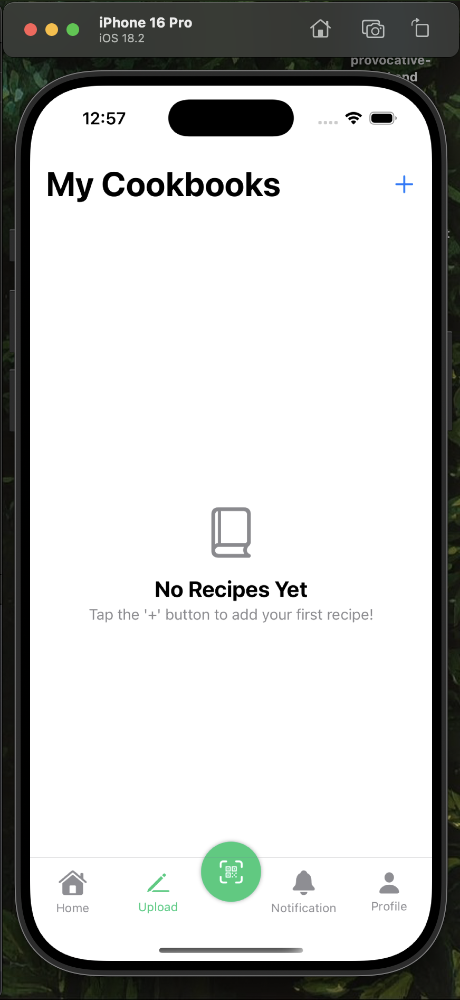
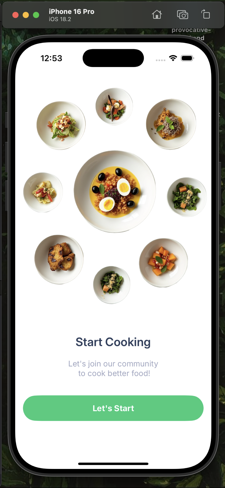
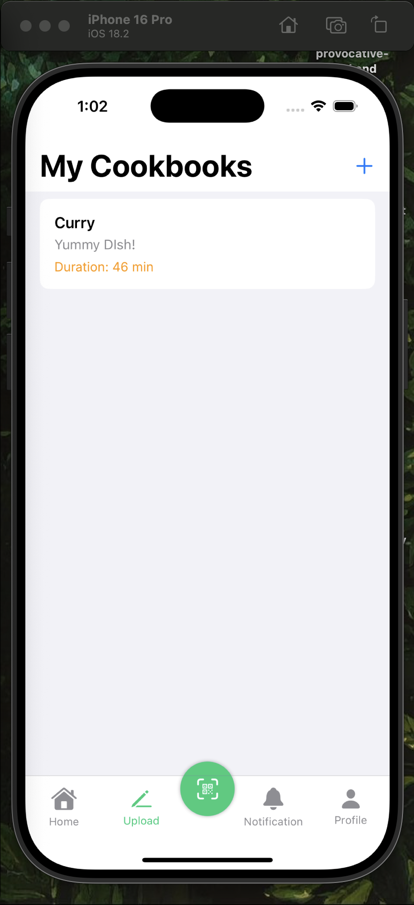
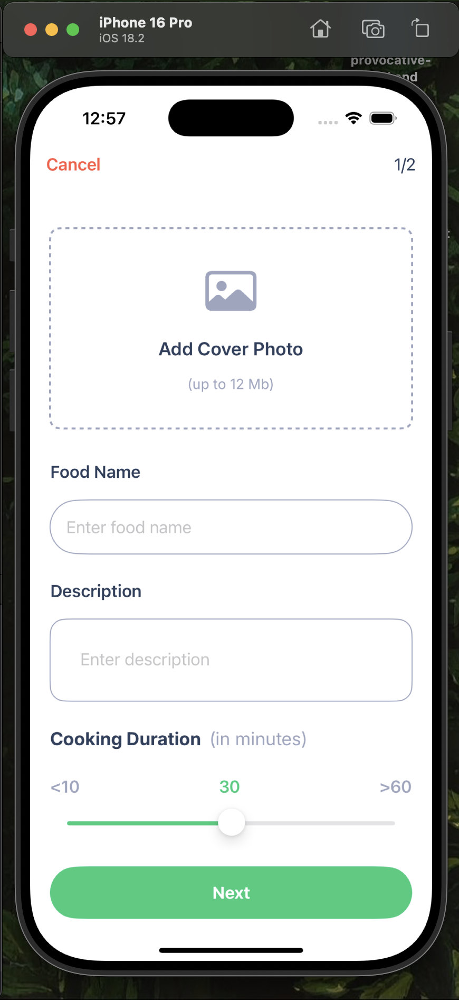
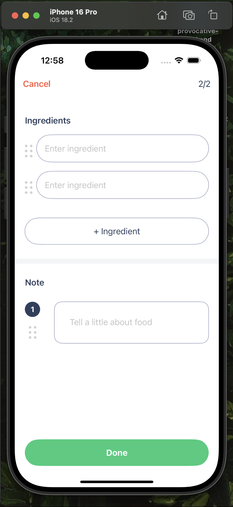
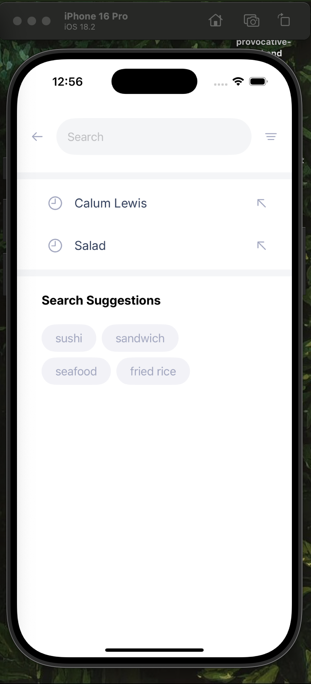
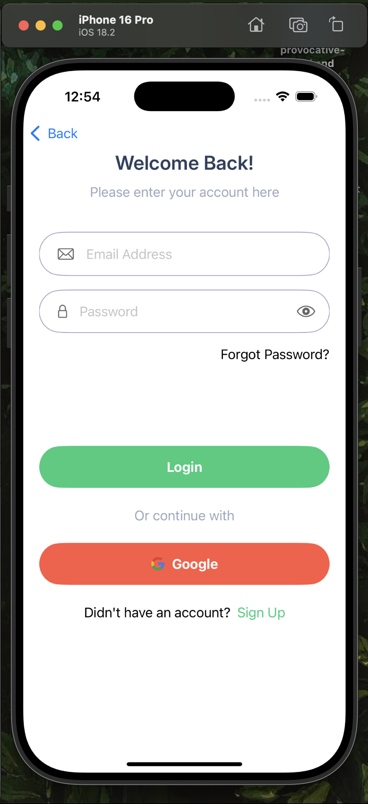
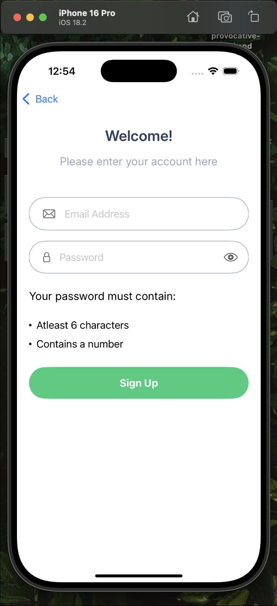

# RecipeVault: Your Personal Recipe Collection

## Overview

This application is a personal recipe repository built entirely using SwiftUI and incorporating modern architectural patterns and data persistence techniques. Inspired by the UI design showcased at [https://www.mockplus.com/example/rp/72](https://www.mockplus.com/example/rp/72), RecipeVault allows users to effortlessly upload and save their favorite recipes. What sets this app apart is its implementation of the Model-View-ViewModel (MVVM) architecture for a clean and maintainable codebase, and the use of SwiftData for seamless, persistent data storage. Even user authentication (login and signup) leverages SwiftData to securely store user information.

This project was born out of a desire to solidify the knowledge gained from the "SwiftUI and Advanced Programming in Swift" course on Coursera and to explore concepts beyond the curriculum, specifically MVVM and SwiftData.

## Key Features

* **Recipe Upload:** Users can easily add their cherished recipes to the app.
* **Persistent Storage:** Utilizing SwiftData, all uploaded recipes are saved and remain accessible even after the app is closed and reopened.
* **MVVM Architecture:** The application follows the Model-View-ViewModel design pattern, promoting code organization, testability, and separation of concerns.
* **User Authentication:**
    * **Signup:** New users can create accounts, with their password securely hashed before being stored using SwiftData.
    * **Login:** Existing users can log in using their credentials, which are verified against the stored data in SwiftData.

## Technologies Used

* **SwiftUI:** The declarative UI framework from Apple for building user interfaces across all Apple platforms.
* **SwiftData:** Apple's modern data persistence framework for storing and managing app data.
* **MVVM (Model-View-ViewModel):** An architectural pattern that separates the UI (View) from the application logic (ViewModel) and data (Model).
* **Password Hashing:** Securely storing user passwords using hashing algorithms (implementation details would be in the codebase).

## Screenshots

Here are some key screens of the application:

<table>
  <tr>
    <td></td>
    <td></td>
    <td></td>
    <td></td>
  </tr>
  <tr>
    <td></td>
    <td></td>
    <td></td>
    <td></td>
  </tr>
  <tr>
    <td></td>
    <td></td>
    <td></td>
    <td></td>
  </tr>
</table>

## Learning Journey

This project represents a significant step in my iOS development journey, undertaken after completing the "SwiftUI and Advanced Programming in Swift" course on Coursera. It involved:

* **UI Replication:** Initially focusing on replicating the visual design from the provided Mockplus example to gain practical SwiftUI layout skills.
* **Architectural Exploration:** Delving into the MVVM architecture to understand its benefits in structuring SwiftUI applications.
* **Data Persistence Mastery:** Learning and implementing SwiftData to handle the persistent storage of recipe data and user credentials.
* **Beyond the Curriculum:** Proactively seeking knowledge and implementing SwiftData, a technology not explicitly covered in the Coursera course, to broaden my skillset.

## Next Steps (Potential Future Enhancements)

* Adding the ability to categorize recipes.
* Implementing search functionality.
* Allowing users to edit and delete their recipes.
* Exploring more advanced UI elements and interactions.
